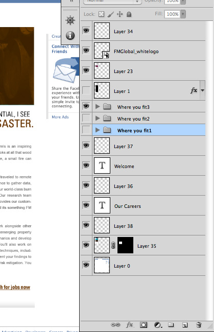
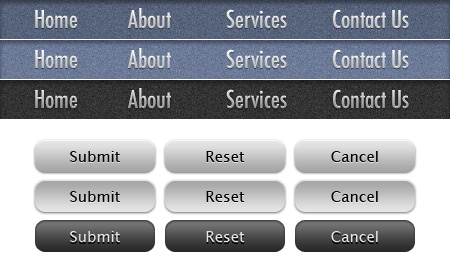
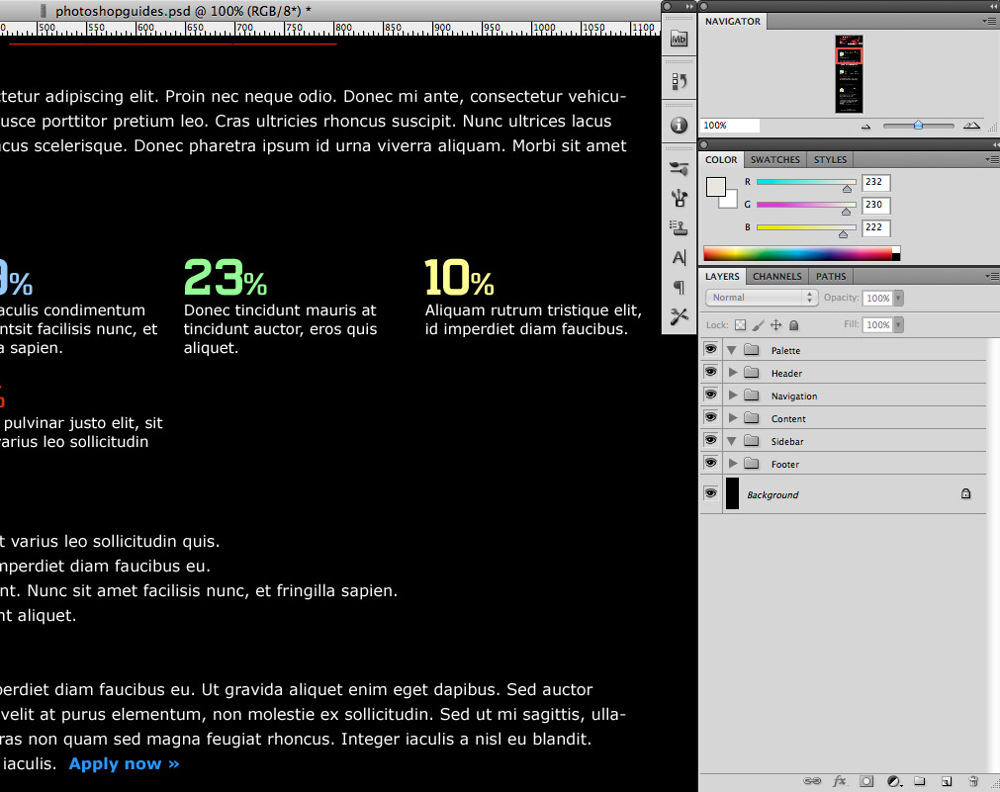
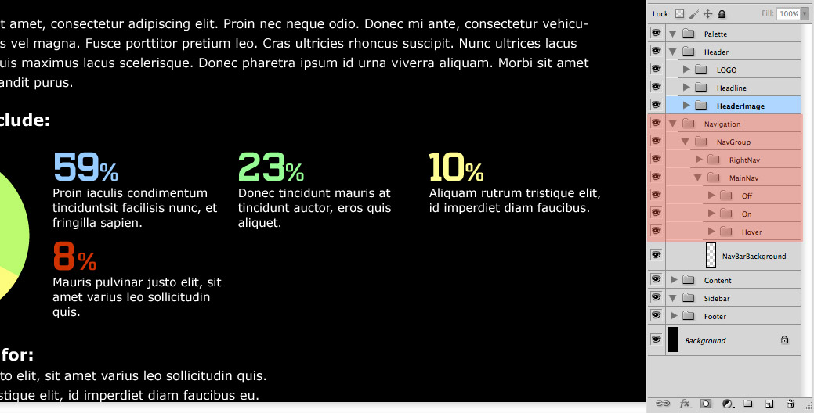

# {{ page.title }}

By [Deborah Foerst](https://github.com/dafoerst)

Last Updated: **{{ "now" | date: "%A, %B %-d, %Y" }}**

<section id="our-standards" markdown="block">
 
## 1.0 Introduction

This document gives general guidelines for art directors on setting up Photoshop files to hand off to web developers for programming web pages.

While the development process is generally very structured, by contrast, the design process is quite often spontaneous and full of experimentation. This can lead to a host of unused and unnamed layers that don’t end up as part of the final approved design. For developers, sifting through many unnamed layers (Layer 1, Layer 23 copy, etc.) can be confusing and time consuming.

[Return to Table of Contents](#table-of-contents){: .back-to-toc }
 
## 2.0 Prepping the File  

If possible, create separate Photoshop Document files for the homepage and each separate template page layout (example: secondary, tertiary, and specialized pages). As efficient as it may seem to use one PSD for all page layouts, it’s actually easier to work with multiple small PSD files, each containing a single template. 

Before making changes to the approved Photoshop design, make another version for the web developers so as not to destroy the approved Photoshop file. The approved design may have experimental layers not necessary for the web developer’s purpose. This way, any unnecessary layers can be deleted, and the art director can still have the final design intact. 

### 2.1 Guides and Layout

Properly align and remove any unnecessary guidelines within a Photoshop document. If possible, keep guides to a minimum and only section off the major regions if you decide to place any guides within the document. Outline blocks of page content such as:

* Header
* Content Area
* Sidebar
* Footer

These guidelines will help the developer understand the basic structure to follow. Also, a smaller number of guides will allow the developer to add guides as needed to visually map out layout details in the code, such as nested divs and navigation menus.

### 2.2 Include a Color Palette/List or Style Guide

Create a layer group within the Photoshop file or create a Word document with a list of colors and styles, especially the ones not in the PSD files such as the hover states for text links. The style guide and/or color palette/list can define the website’s common page components such as the font size and style for body copy, page headers, sub heads, etc. 

Also, if the client supplied brand specs for the development of their websites, please supply those.

[Return to Table of Contents](#table-of-contents){: .back-to-toc }
 
## 3.0 Common Elements

Common elements, such as images, which are placed in the same area on a page or are part of the navigation, should be the same width and height. For instance, an employee profile page will most likely have a large image of the employee. These images should be consistent in size, as well as thumbnail images used as navigation. 

Common elements, if **_possible_**, could have their own PSD file to the width and height of the element, instead of creating a PSD file for each page, especially when these pages have the same layout. If each page has been laid out for the client’s approval, this process is not necessary. 

[Return to Table of Contents](#table-of-contents){: .back-to-toc }

## 4.0 Navigation and Button States

Navigation elements sometimes get overlooked but should have at least two and maybe three states of user interaction that the developer will need to define in the style sheet. Place each state on its own layer name to correspond to its function, such as topnav, topnav:hover, etc.  This also should be done for any type of button. As mentioned later within this document, these elements should be grouped in their own folder. 

This will allow the developer to easily create sprite groups of navigation or button layers or layer groups, so these elements can be executed in the code properly. Below is an example of what the developer will prepare from the Photoshop file.

[Return to Table of Contents](#table-of-contents){: .back-to-toc }
 
## 5.0 Flattening Artwork

Sometimes, flattening layers, such as complex graphics, is necessary to preserve the approved design and to combine multiple layered elements into a single layer, so that the developer does not need to guess which layer goes with another. Examples of this would be a base layer which is being used as a clipping mask and secondary layers that are being clipped by the base layer; photomontages or a group of layers that comprise the background of the site; or even a photo used on the site. 
 
### 5.1 Merging Layers

Merge layers, which will not require further editing by the developer. This provides a clearer road map for the developer and also removes the chance of the design elements getting accidently altered during image slicing. 

### 5.2 Fonts

Web fonts, which are used for headings and copy, should be left as editable text. This allows developers to easily check the character panel to see what values need to be applied to font properties in the style sheet. **Pixels** should be used when sizing fonts instead of **point** sizes, and the size of the fonts should be rounded off (full numbers). Do not use kerning in editable text when designing web sites. Kerning will only remain intact if made into rasterized or flattened images. Also, for text, anti-aliasing would be best to set as crisp. This is better for web design.

Along with the Photoshop files, supply the fonts, which may not be common on most platforms. Specify if these fonts are client specific. 

Fonts that are not considered web safe fonts ([list of web safe fonts](http://www.ampsoft.net/webdesign-l/WindowsMacFonts.html)) may be available as web fonts from the websites below. Please check the availability before using these fonts in the designs. As with images and other media, check the license of the font you wish to use before implementing it. Many fonts are not yet licensed for this kind of use on the web, so notify the Digital Project Manager and UI Developer about these fonts.

* [Google Web Fonts](http://www.google.com/fonts/) – Free
* [Font Squirrel](http://www.fontsquirrel.com/) – Free
* [Fonts.com](http://www.fonts.com/) – Some are free, most are not

#### 5.2.1 Testing Fonts

Just because a font can be used on the web does not mean it should be used for all content on the site. Certain fonts were designed to work well on screen, but not all fonts were, especially when using these fonts in small sizes. The recommended use for these fonts is to use them for headlines and special types of elements, not for all content. Check fonts at the following site: [Font Dragr](http://fontdragr.com/).  Drag a font file to the page and the text will change to that font.  

### 5.3 Smart Objects (Vector and Raster)*

If using smart objects within the Photoshop file, the designer should rasterize or merge with other layers to reduce the overall file’s size because smart objects can often contain photos or other artwork, which most likely will have a higher resolution (e.g. 300 dpi) than is required for the final output. Another reason for flattening these smart objects is to prevent a “File Not Found” error message in case the developer double clicks the smart object layer. 

**Note:** If the site that is being designed is responsive, images may need to be sized or cropped differently, so rasterizing an image may not always be ideal. If you are uncertain, work closely with the UI development team to determine the best course of action.  

### 5.4 Background Images

The web is a dynamic environment, so make sure that any complex background graphics fit. Check that the image or images extend beyond the right and bottom of the browser window so that the images are large enough to accommodate an expanded browser window. This is especially important now because responsive websites can be viewed on many devices.

[Return to Table of Contents](#table-of-contents){: .back-to-toc } 

## 6.0 Organizing the Layers Panel

The first item is to delete all unnecessary layers, especially those duplicate layers, which were created to test ideas during the design process. 

### 6.1 Name All Layers

Go through all the layers and name the layers and layer groups. Use a naming convention that is not only well recognized, but also common to your work environment. One example would be to assign layers names, which provide useful descriptions, such as **“main nav over state”** or **“button:hover"**. Other examples for naming conventions could be according to sections such as **header, content, footer**, etc. 

A suggested best practice would be to create a folder structure when creating the initial Photoshop file for each project or even developing a basic template to use for each project. This template could contain a grid system, basic folder structure, and common dimensions, such as the width of the page.

[Return to Table of Contents](#table-of-contents){: .back-to-toc }
 
### 6.2 Basic Folder Structure

Group elements that belong together into consistent layer groups, such as “header,” “content,” “navigation,” and “footer.” It’s also good practice to group like items that constitute a navigational element or other design elements that have multiple states such as icons, buttons and menus. 

 
Within each folder, sub folders and layers can be added for each sub section or element.  For example, the header section may have “logo,” “headline,” and/or “header image,” etc.

 
Within the navigation, layers or folders could have “hover,” “off,” and “on” states. 

[Return to Table of Contents](#table-of-contents){: .back-to-toc }
 
## 7.0 Finalizing Files

This process may be little too structured for most art directors, especially when the art director is caught in the throes of a great design, but it may make the art director’s life easier when they need to go in and make client changes. 

As we all know, art directors and developers do not always think alike. Whereas designers work in a state of creative chaos, developers tend to typically rely on order, structure, and logic. Any type of organization will help the developer to understand the PSD files better. 

There is certainly no one right way to organize PSD files, so these are suggestions. The art directors may want to reach out to the developers, or the developers may reach out to the art directors.

[Return to Table of Contents](#table-of-contents){: .back-to-toc }

## 8.0 Checklist

* Company’s branding specs
* Make sure colors are consistent throughout all PSDs
* Use same fonts consistently throughout the design
* Pixels should be used when sizing fonts instead of points
* Layers are all named and put into group folders when applicable
* All common images the same size
* Any special instructions
* Hover, Active and/or Visited states are specified for links and buttons
* List the fonts, whether they are web fonts or non-web fonts, off to the side on the homepage using the “note tool” 

</section>
